# インストール・ガイド
このガイドはPE1NWL・Allardさんが作成されたガイドをJJ1EPE・Akiが翻訳したものです。ご質問などがありましたらjj1epe＠jarl.com(＠は小文字)までどうぞ。

## 概要

1. Arduino IDE をPCに[インストール](#Arduino-IDEのインストール)する。

2. [Install](#installing-the-pinchangeinterrupt-library) ライブラリ”PinChangeInterrupt”をPCにインストールする。

3. [Download](#downloading-the-sketch)　Raduinoのスケッチ（ソースコード）をPCにダウンロードする。

4. [Open](#opening-the-sketch) IDEでRaduinoのスケッチを開く。

5. [Compile](#compiling-the-sketch) Raduinoのスケッチsketchをコンパイルする。

6. Bitx40の電源を切る。

7. USBケーブルをRaduinoのUSBポートに接続する。

8. [Upload](#uploading-the-sketch) ファームウエアをRaduinoボードにアップロード（書き込む）する。

9. USBケーブルを外す。

10. Bitx40の電源を入れる。

## Arduino IDEのインストール

Arduino IDE（統合開発環境）は、ソフトウェアを"コンパイル"してArduinoマイクロコントローラチップにアップロード（書き込む）するために必要なソフトウェアです。 Raduinoソフトウェア（または「スケッチ」）はC（プログラミング言語）で書かれています。スケッチ内のプログラム文は、Arduinoマイクロコントローラが理解し実行できるデジタル命令コードに「変換」されていなければなりません。この変換プロセスを「コンパイル」と呼びます。

Arduino IDEソフトウェアは、https://www.arduino.cc/en/Main/Software から無料でダウンロードできます。”Windows Installer, for Windows XP and up”のリンクをクリックしてください。
 
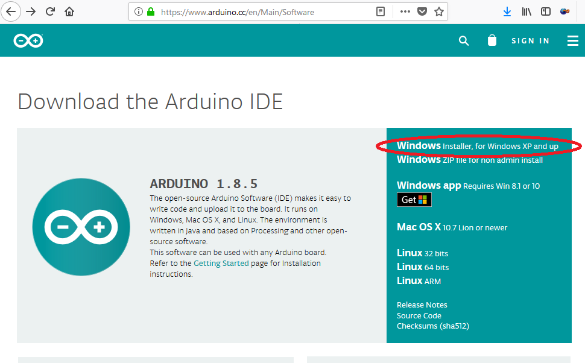

次に 'just download'　をクリックします:

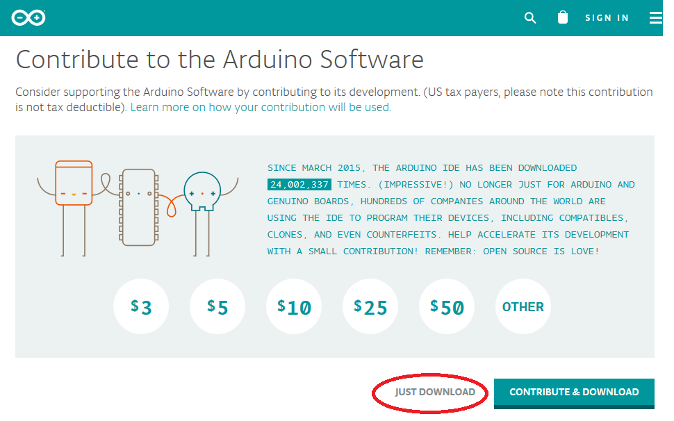

ダウンロードしたファイルを保存して実行します。 “このアプリで端末を変更できるようにしますか？ ”では「はい」をクリックします。

使用許諾契約に同意します:

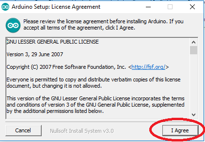

全てのチェックボックスをそのままの設定にしておき、'Next'　をクリックします:

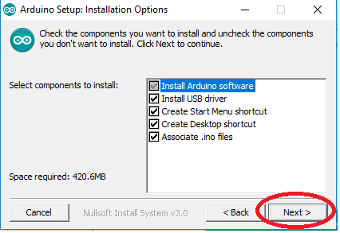

保存先フォルダもそのままにしておき　“Install”　をクリックします：

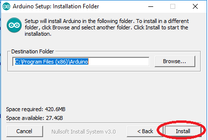

インストールが開始され、すべてのファイルを展開してインストールするのに1分ほどかかります：

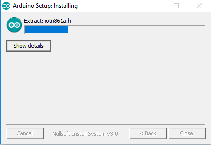

インストールが完了したら“Close”をクリックします：

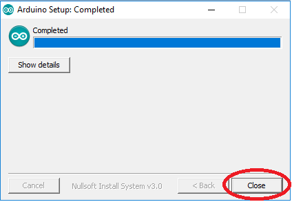

新しくArduinoアイコンがデスクトップに作成されますので、アイコンをダブルクリックしてIDEを起動します：

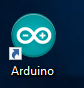

IDEが起動します：

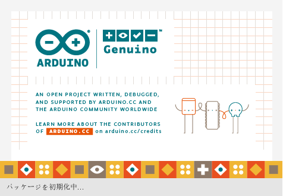

IDEが起動したら、使用言語を日本語に変更します。
"File" => "Preferences"に移動します：

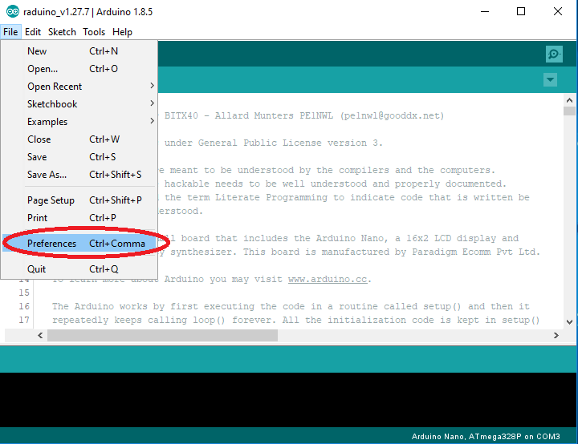

“Editor Language”からプルダウンで“日本語”を選択します：

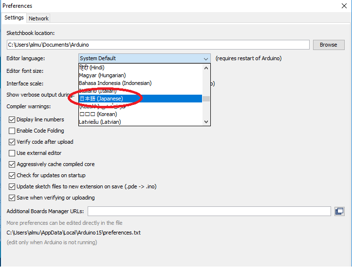

ここで一度IDEを終了し、言語の変更を有効にするために、再起動します：
メニューが日本語に変わります：

次ぎに、書き込むデバイスの選択のために、”ツール”=>”ボード”=> “Arduino Nano”を選択します：

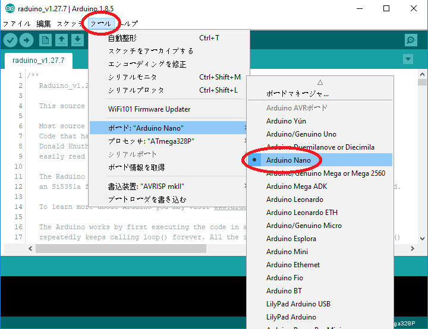

次に “ツール”から “プロセッサ“ => “ ATmega328P”を選択します：

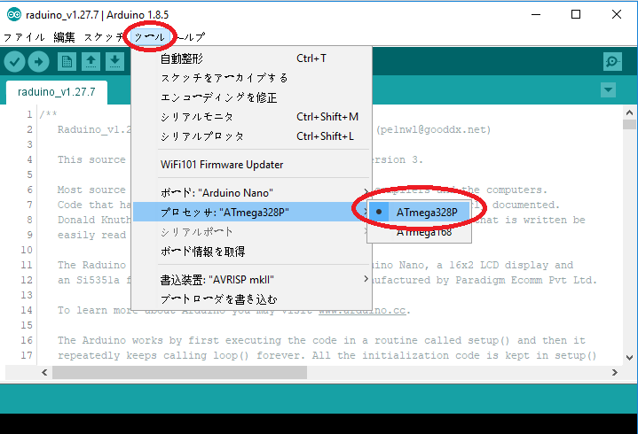

続いて “ツール”から “書込装置“ => “AVRISP mkii”を選択します：

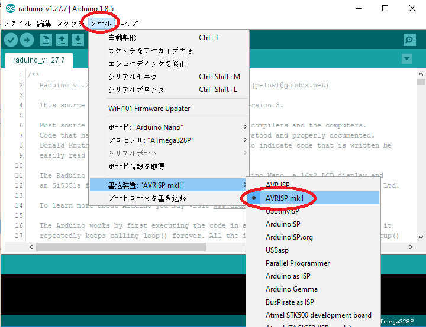

## ライブラリ ”PinChangeInterrupt” のインストール

このスケッチのバージョンでは、割り込み処理のためにライブラリ "PinChangeInterrupt"が必要です[pinChangeInterrupt"](https://playground.arduino.cc/Main/PinChangeInterrupt) 。
これは標準のライブラリではありません（デフォルトではインストールされていません）。 PCにインストールするには、次の手順で行います。
これは１回行うだけです。ult).

1.メニューの　“スケッチ”　から “ライブラリをインクルード” => “ライブラリを管理”　を選択します：

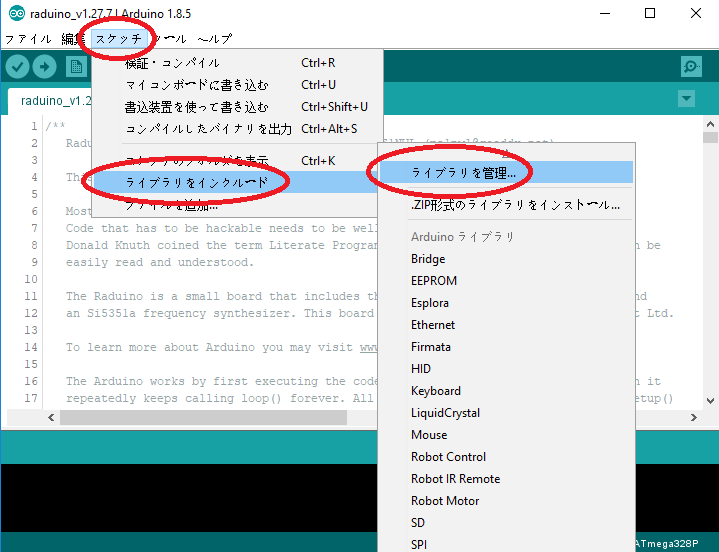

2.ライブラリ・マネージャーが起動します。すでにインストールされているライブラリが表示されるまで待ちます：

3.　検索ボックスで "pinchangeinterrupt"　を入力します:

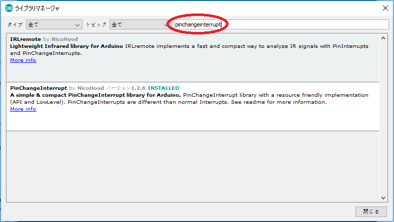

4.　“Pin Change Interrupt by NicoHood” という名前のライブラリを選択し、 "インストール" をクリックします:

5.　インストールが完了するまで待ち、完了したら“閉じる”をクリックします：

## スケッチのダウンロード

“github” のページで緑色の "Clone or download"ボタンをクリックします：

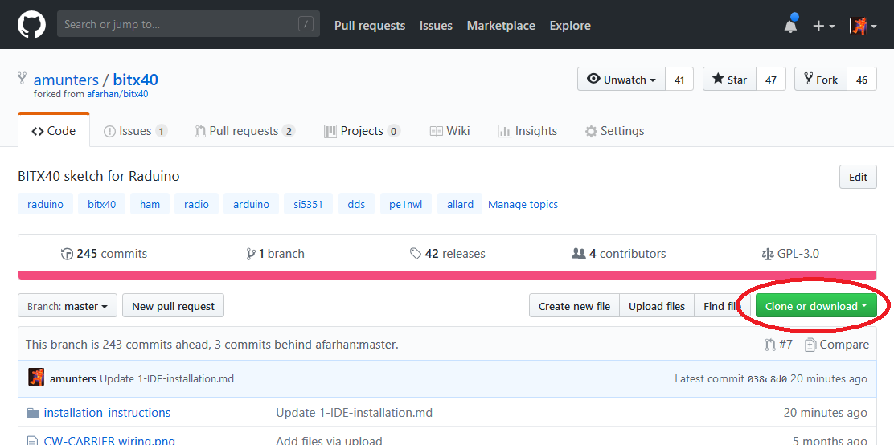

'download ZIP'をクリックします:

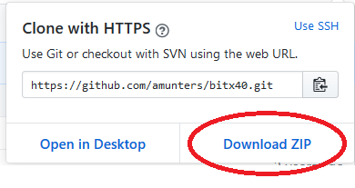

ファイルは、PCのダウンロードフォルダにダウンロードされます。
ダウンロードフォルダに移動して"bitx40-master"という名前のファイルを探してダブルクリックします：

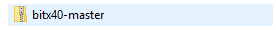

"展開" をクリックします:

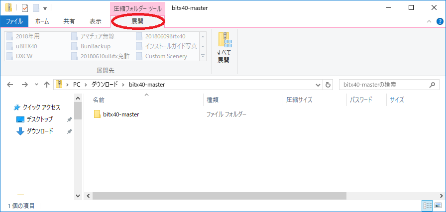

次に "全て展開" をクリックします:

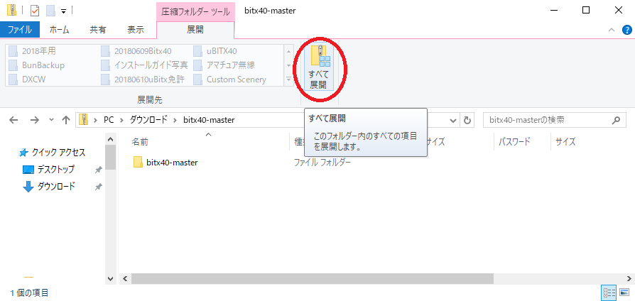

必要に応じて、 ”参照”　ボタンを使用して、ファイルが展開される場所を変更します。
次に、"展開"　を押します:

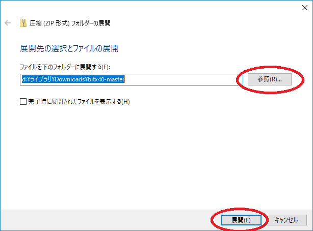

上の手順で選択した場所に「bitx40-master」という名前の新しいフォルダが作成されます：

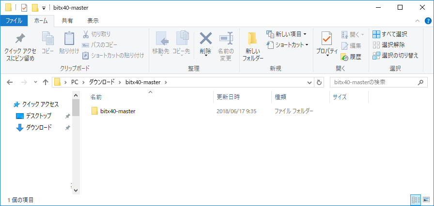

新しく作成されたフォルダ "bitx40-master"には複数のファイルが含まれています。それらの1つは "raduino_v1.27.7.ino"という名前です。これは実際のRaduinoファームウェアです。

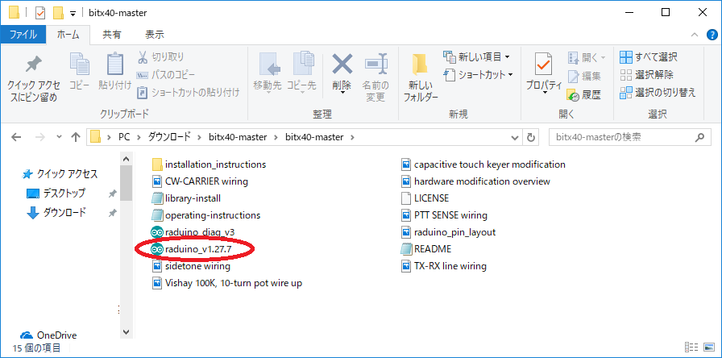

## スケッチを開く

フォルダ "bitx40-master"の中から、ファイル"raduino_v1.27.7.ino"を見つけてダブルクリックします：

 Arduino IDE が起動します:

次のメッセージボックスが表示されることがありますが、 OKを押します：

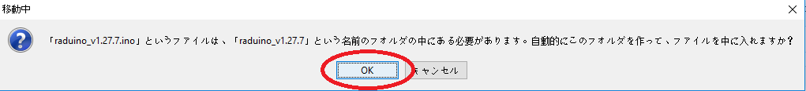

スケッチが開き、プログラムコードがIDEに表示されます：

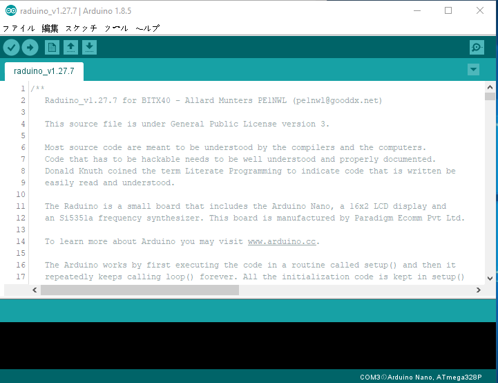

## スケッチのコンパイル

IDEで、下図の“コンパイル” ボタンをクリックします:

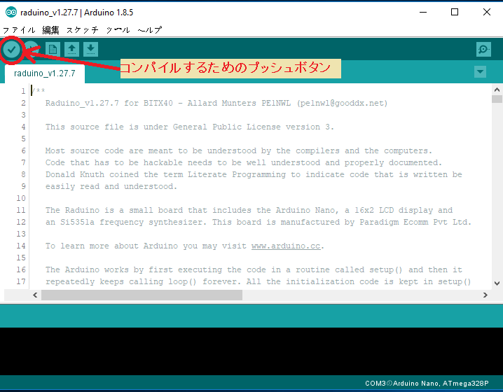

コンパイルが開始されます。完了するまでに数分かかる場合があります：

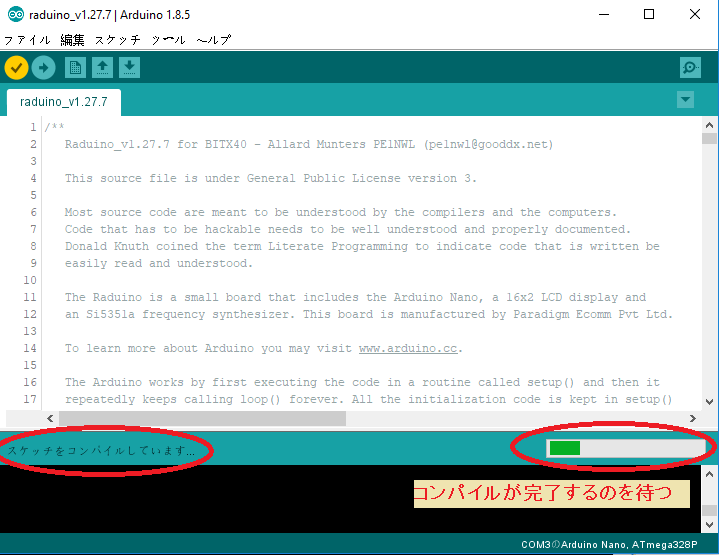

コンパイルが完了すると、次の画面が表示されます：

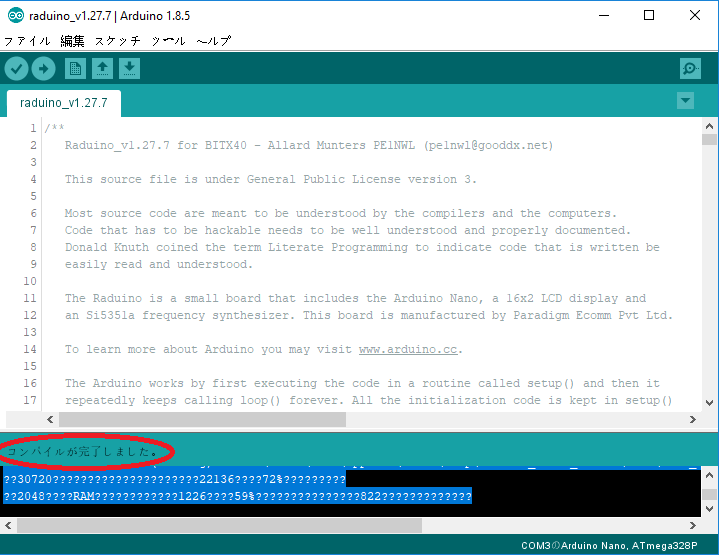

## スケッチのアップロード（書込み）

最初にBitx40の電源を切ります。
次ぎに、PCのUSBポートとBitx40のUSBポートをUSBケーブルを接続します。
この場合、USBケーブルを介してPCから電源が供給されるため、Raduinoのディスプレイは点灯します。Bitx40自体は動作しません。

 IDE上で下図の ”アップロード” ボタンをクリックします:

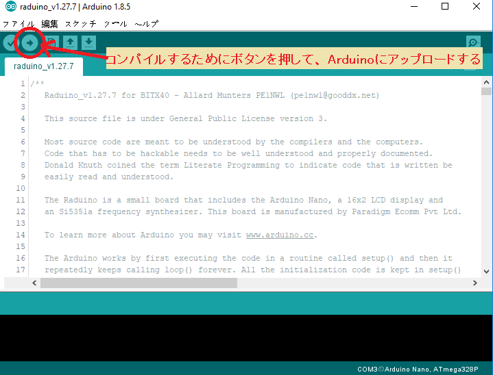

スケッチは最初に再度コンパイルされますが、これには数分かかることがあります：

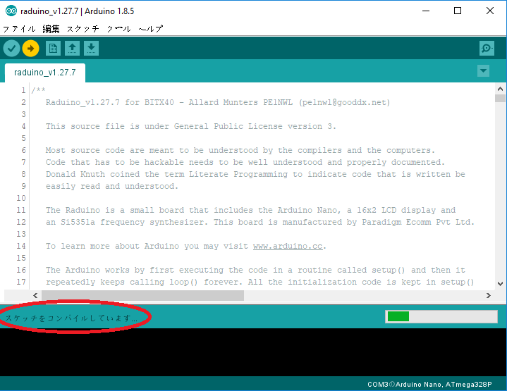

そして、スケッチがArduinoにアップロードされます。これにはもう1分ほどかかります：

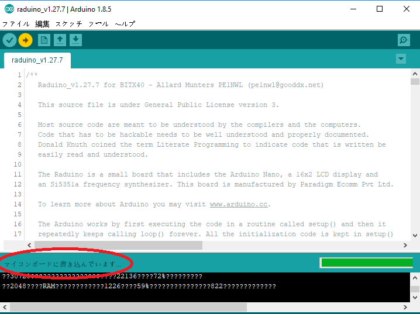

アップロードが完了しました：

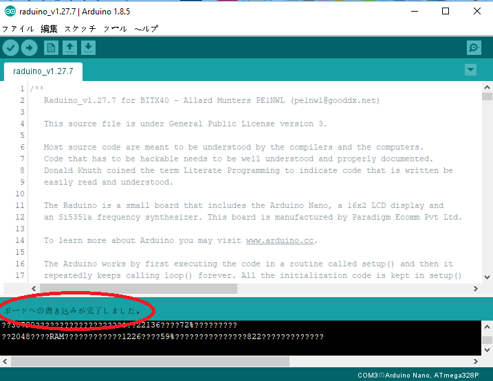

Raduinoが再び起動し、新しいファームウェアのバージョン番号がディスプレイに短時間表示されます：

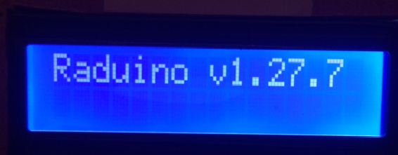

USBケーブルを外します：.

Bitx40の電源を入れます。 Raduinoが起動します。
新しいファームウェアをお楽しみください。 Happy BitX-ing！
